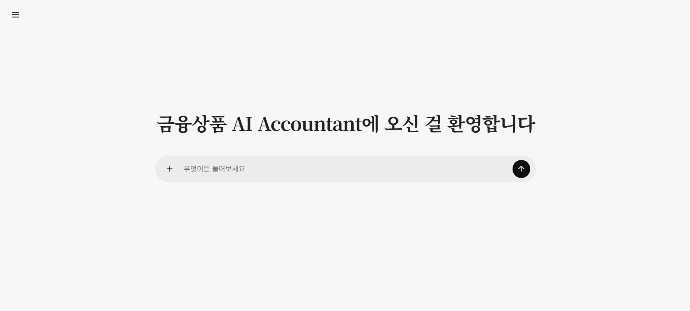
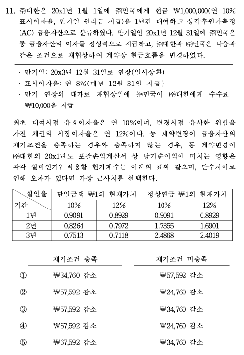

# K-IFRS Financial Instruments QA

K-IFRS 제1032호·제1039호·제1107호·제1109호를 구조화해 Neo4j에 적재한 금융상품 텍스트·이미지 질의응답 서비스입니다. 검색한 기준서 원문을 최우선 근거로 삼고, 질문에 주어진 사실·숫자·표와 일반 회계 지식·계산·논리적 추론을 함께 사용합니다.

라이브: https://accounting-rag.pages.dev

## 서비스 화면



## 실제 사례 — 2026 CPA 1차 회계학

아래는 2026년 공인회계사 제1차시험 회계학의 금융상품 관련 문항입니다. 금융부채의 계약조건 변경 시 제거조건 충족 여부와 조건변경손익을 묻습니다.

<p align="center">
  
</p>

이 문항의 회귀 기준은 **⑤ ₩182,891**입니다.

1. 최초 장부금액: `₩30,000 × 2.7232 + ₩1,000,000 × 0.8638 = ₩945,496`
2. 조건변경 직전 장부금액: `₩945,496 × 1.05 - ₩30,000 = ₩962,771`
3. 변경 현금흐름을 최초 유효이자율 5%로 할인: `₩10,000 × 2.7232 + ₩950,000 × 0.8638 = ₩847,842`
4. 차이 `₩114,929`은 기존 장부금액의 약 11.94%이므로 제거조건을 충족합니다.
5. 신규 부채 공정가치: `₩10,000 × 2.5770 + ₩950,000 × 0.7938 = ₩779,880`
6. 조건변경이익: `₩962,771 - ₩779,880 = ₩182,891`

최종 답변 모델에는 추출 텍스트 대신 원본 이미지가 직접 전달되지만, 작은 글자·복잡한 표·유사한 숫자에 대한 비전 판독 오류 가능성은 남아 있습니다.

## 한눈에 보는 질의 흐름

텍스트 질문은 OpenAI를 **임베딩 1회 + 답변 생성 1회** 호출합니다. 이미지를 첨부하면 검색어 생성을 위한 이미지 분석 호출 1회가 앞단에 추가되며, 이 분석 결과는 검색에만 사용됩니다.

```text
사용자 질문(선택) + 원본 이미지(선택)
 │
 ├─ 이미지가 있으면 검색정보 생성             api/dependencies.py
 │    semantic_query → Dense 검색
 │    keywords       → Sparse 검색
 │    정답·계산·전체 OCR 텍스트는 생성하지 않음
 │
 ▼ ① Hybrid 검색                             retrieval/hybrid.py
 │     Dense 벡터 top 50 ─┐
 │                        ├─ 원점수 임계값(Dense 0.60 / Sparse 30.0)
 │     CJK Sparse  top 50 ─┘  → weighted RRF → seed 최대 10개
 │
 ▼ ② 형제 청크 보강                          retrieval/pipeline.py
 │     같은 Paragraph에서 나온 나머지 Chunk를 질문 전체에서 최대 8개 추가
 │
 ▼ ③ 답변 생성 (OpenAI Structured Output)     generation/answer.py
 │     사용자 질문(있는 경우) + 원본 이미지 + evidence만 입력
 │     이미지 검색분석 결과는 최종 모델에 전달하지 않음
 │     evidence 최대 20개·항목당 1,800자·전체 50,000자
 │
 ▼ 두괄식 결론 / 판단 과정 / 근거
```

**답변 이후 별도 판정 게이트가 없습니다.** 이전에는 기계 판정 6종, 의미 판정 LLM, 근거 필터, 인용 검증까지 네 개의 거절 지점이 있었습니다. 지금은 임계값 통과 청크가 0개일 때만 `insufficient`로 분류하고, 청크가 하나라도 있으면 모델 응답을 `answered / evidence_available`로 반환합니다.

Dense·Sparse 후보를 각각 50개까지 가져온 뒤 원점수 임계값(Dense 0.60, Sparse 30.0)을 통과한 후보만 RRF에 넣고 최종 seed는 10개로 제한합니다. Dense 하한은 검색 누락을 줄이기 위해 기존 0.70에서 0.60으로 완화했으며, 재랭커가 없으므로 낮은 유사도의 문단이 포함될 수 있다는 절충이 있습니다.

### 왜 이렇게 바꿨나

| 문제 | 원인 | 조치 |
|---|---|---|
| 정상 질문의 60%가 기각 | 의미 판정 프롬프트가 "예외까지 전부 커버"를 요구. K-IFRS는 어떤 주제든 예외가 딸려 있어 상위 12개 청크로는 절대 충족 불가 | 판정 단계 제거 |
| 같은 질문이 실행마다 다른 결과 | 기계 판정이 재정렬 LLM의 점수에 의존했는데 `temperature` 미설정이라 점수가 흔들림 | 재정렬 제거 |
| 생성 LLM 호출 최대 12회 | 질문 분석 1 + 재정렬 4×2 + 판정 1×2 + 답변 1 | 답변 생성 1회(텍스트 질문 기준, 임베딩 제외) |

같은 질문 6개로 측정한 결과 **답변 성공 2/6 → 5/6**. 범위 밖 질문("오늘 서울 날씨")은 여전히 거절합니다.

## 답변 원칙과 출처 위조 방지

답변 모델은 검색된 evidence를 회계기준 판단의 최우선 근거로 사용합니다. evidence와 충돌하지 않는 범위에서는 질문에 포함된 사실·숫자·표와 일반 회계 지식·계산·논리적 추론을 함께 사용합니다. 결론은 두괄식으로 작성해 정답, 최종 선택지 또는 핵심 회계처리를 첫 문장에 제시합니다.

출처를 지어내지 못하게 하는 방법은 두 가지입니다. 모델에게 물어본 뒤 대조하거나, **아예 묻지 않거나.** 두 번째를 택했습니다.

모델이 돌려주는 것은 세 가지뿐입니다.

```json
{
  "conclusion": "금융자산은 현금과 지분상품을 포함한다. [E2]",
  "reasoning": ["문단 11이 금융자산을 열거한다. [E2]"],
  "evidence": ["E2"]
}
```

`evidence`는 **번호 목록**입니다. 출처(`citation`)와 원문(`statement`)은 검색 단계에서 우리가 만든 근거 목록에서 `E2`를 조회해 채웁니다. 모델의 출력을 쓰지 않으므로 **변조될 통로 자체가 없습니다.**

`generation/answer.py`의 `_assemble_answer()`가 이 조립을 담당하며, 거절하거나 폐기하지 않습니다.

- 모르는 번호(`E9`)를 말하면 **그 항목만** 버리고 답변은 살립니다
- 본문에 `[E1]`을 썼는데 목록에서 빠뜨렸으면 마커에서 찾아 카드를 만듭니다
- 문장에 인용이 없어도 답변을 버리지 않습니다

### 이전 방식과 무엇이 달랐나

검사 6종을 두고 하나라도 어긋나면 답변 전체를 폐기했습니다. 실측 결과 **14개 질문 중 3개가 이 검사 때문에 죽고 있었습니다.**

| 질문 | 모델이 실제로 한 일 | 검사 결과 |
|---|---|---|
| 법인세비용 계산 | 근거 3개를 인용하며 "제1012호 소관"이라 정확히 안내 | 문장 하나에 마커 없음 → **전체 폐기** |
| 오늘 서울 날씨 | "제공된 근거는 K-IFRS 금융상품 내용"이라 구체적으로 거절 | 접두사 불일치 → **전체 폐기** |

폐기된 답변은 모두 `근거 부족: 검증된 답변을 생성하지 못했습니다.`라는 똑같은 문구로 대체됐습니다. 모델이 한 유용한 설명이 버려진 것입니다.

**바꾼 뒤 같은 14개 질문에서 검증으로 폐기된 답변은 0건입니다.**

### 답변 상태 판정

검색 결과가 0건이거나 모든 후보가 원점수 임계값에 미달한 경우에만 생성 전에 `insufficient`로 판정합니다. 통과 청크가 하나라도 있으면 빈 인용 목록, 부분 답변, 범위 밖 설명도 문자열로 다시 판정하지 않고 모델 응답을 그대로 표시합니다.

## 하위항목(⑴ → ㈎ → ①)을 다루는 방식

기준서 문단은 계층적 하위항목을 갖습니다. 이걸 검색 시점에 그래프로 복원하지 않고 **청킹 단계에서 이미 해결**했습니다.

```text
청크 KIFRS1032-11-C01 (834자, 원문 노드 17개를 덮음)

  금융자산은 다음의 자산을 말한다.          ← 부모 줄기가 함께 들어 있다
  ⑴ 현금
  ⑵ 다른 기업의 지분상품
  ⑶ 다음 중 어느 하나에 해당하는 계약상 권리
    ㈎ 거래상대방에게서 현금 등 금융자산을 수취할 계약상 권리
    ㈏ 잠재적으로 유리한 조건으로 …
  ⑷ 기업 자신의 지분상품으로 결제하거나 …
    ㈎ 수취할 자기지분상품의 수량이 변동 가능한 비파생상품
    ㈏ 확정 수량의 자기지분상품을 … 파생상품
      ① 문단 16A와 16B에 따라 지분상품으로 분류하는 풋가능 금융상품
      ② 발행자가 청산하는 경우에만 …
      ③ 자기지분상품을 미래에 수취하거나 인도하기 위한 계약인 금융상품
```

Aura 실측 근거:

| 확인 항목 | 값 |
|---|---|
| `Subparagraph -CONTAINS-> Subparagraph` 중첩 | **0건** (파서가 평탄화, 깊이는 1뿐) |
| 청크 하나가 덮는 원문 노드 수 | **최소 2개** (조각만 담은 청크가 없음) |
| 한 문단이 청크 1개에 온전히 들어간 비율 | **3,701 / 3,831 = 96.6%** |

**남은 3.4%가 형제 청크 보강(②단계)의 존재 이유입니다.** 문단이 길면 크기 제한 때문에 여러 청크로 갈리는데, 그때 뒷부분만 검색에 걸리면 앞부분 없이 답변이 만들어집니다. `DERIVED_FROM`으로 같은 `Paragraph`를 공유하는 청크를 끌어와 메웁니다.

```cypher
MATCH (hit:Chunk)-[:DERIVED_FROM]->(p:Paragraph)<-[:DERIVED_FROM]-(sibling:Chunk)
WHERE hit.chunk_id IN $chunk_ids
  AND sibling.searchable = true
  AND NOT sibling.chunk_id IN $chunk_ids
```

형제까지 합쳐도 평균 1,283자, p95 3,326자, 최대 6,250자라 컨텍스트 예산 안에 들어옵니다.

## 프레임워크를 쓰지 않은 이유

LangChain·LangGraph 없이 Neo4j Driver와 OpenAI SDK를 직접 호출합니다. 핵심 QA 파이프라인은 검색 → 형제 청크 보강 → 답변 생성의 3단계이고, 선택적 이미지 전처리와 비동기 작업 관리는 API 경계에 분리되어 있습니다. 반복적인 에이전트 상태 전이가 없어 프레임워크 추상화보다 호출 지점을 직접 보는 편이 디버깅에 유리합니다.

## 웹 UI와 이미지 입력

- 질문은 최대 **2,000자**이며, PNG·JPEG·WEBP·GIF 이미지를 최대 4장, 장당 5MB까지 첨부할 수 있습니다.
- 첨부 이미지 분석 모델은 전체 OCR이나 정답 대신 `semantic_query`와 `keywords`만 구조화 출력합니다. Dense 검색은 `semantic_query`, Sparse 검색은 `keywords`를 사용합니다.
- 최종 답변 모델에는 사용자 질문(있는 경우), 검색된 evidence, 원본 이미지만 전달합니다. 이미지 검색분석 결과나 임의의 이미지 풀이 지시는 전달하지 않습니다.
- 이미지는 서버에 파일로 저장하지 않으며 OpenAI 호출은 모두 `store=False`입니다. 검색분석에는 `detail=high`, 최종 답변에는 `detail=original`을 사용합니다.
- 웹 UI는 `request_id`가 있는 비동기 작업을 생성하고 폴링합니다. 같은 ID의 재요청은 같은 작업을 돌려줘 네트워크 재시도 중 중복 실행을 막습니다.
- 대화 기록은 최대 30개를 브라우저 `localStorage`에만 보관합니다. 진행 중 요청의 재시도 payload는 `IndexedDB`에 임시 보관하고 완료 시 삭제합니다.

## 데이터 현황 (Neo4j AuraDB Free 실측)

노드 22,018개 · 관계 92,121개 · 검색 대상 Chunk 4,144개

| 노드 | 개수 | | 관계 | 개수 |
|---|---:|---|---|---:|
| Block | 8,533 | | APPEARS_ON | 19,968 |
| Chunk | 4,379 | | MENTIONS | 17,712 |
| Paragraph | 3,904 | | DERIVED_FROM | 14,087 |
| Subparagraph | 2,125 | | REFERS_TO | 12,796 |
| PdfPage | 1,671 | | NEXT | 11,435 |
| Section | 713 | | CONTAINS | 8,433 |
| Table | 362 | | HAS_BLOCK | 6,674 |
| Footnote | 227 | | HAS_TABLE | 574 |
| Concept | 45 | | HAS_FOOTNOTE | 442 |
| ExternalStandard | 35 | | | |
| Zone | 20 | | | |
| Standard | 4 | | | |

인덱스 3개 모두 ONLINE: `chunk_embedding_vector`(VECTOR, 3072차원 cosine) · `chunk_fulltext`(FULLTEXT, `cjk` analyzer) · `concept_fulltext`(FULLTEXT)

**질의 시점에 사용하는 것은 `chunk_embedding_vector`, `chunk_fulltext`, `DERIVED_FROM` 세 가지뿐입니다.** 나머지 그래프(REFERS_TO, MENTIONS, Concept 등)는 적재·검증되어 있지만 현재 검색 경로에서는 읽지 않습니다. 색인 파이프라인의 산출물이자 향후 확장 여지로 남아 있습니다.

## 색인 파이프라인 (질의와 별개, 사전 1회 실행)

```text
HWPX 원본 4개
 ▼ parse_all_standards.py     문단·블록·표·각주·참조 추출 → data/processed/
 ▼ map_pdf_pages.py           PDF 1,671쪽과 문단 매핑
 ▼ build_chunks.py            검색용 Chunk 생성 → data/chunks/
 ▼ build_embeddings.py        text-embedding-3-large 3,072차원 → data/embeddings/
 ▼ build_semantic_kg.py       공식 정의 기반 Concept·MENTIONS → data/semantic/
 ▼ load_neo4j.py / load_semantic_neo4j.py / load_embeddings_neo4j.py
```

각 단계마다 `validate_*.py`가 짝으로 있고, 품질 보고서를 `data/**/*_QUALITY_REPORT.md`에 남깁니다.

## 배포 구성

| 계층 | 서비스 | 주의사항 |
|---|---|---|
| 프론트엔드 | Cloudflare Pages | 정적 자산 업로드. FastAPI 라우트가 없으므로 `/favicon.ico` 같은 서버 경로에 의존하면 안 됨 |
| 백엔드 | Render 무료 (Docker) | 15분 유휴 시 슬립 → 첫 요청 최대 1분 |
| 데이터베이스 | Neo4j AuraDB Free | 3일 미사용 시 일시정지, 30일 지속 시 삭제 |

배포 검토 당시 Hugging Face Spaces 대신 Render를 선택했습니다. 현재 배포 절차는 `DEPLOYMENT.md`를 참고하세요.

## 로컬 실행

```powershell
pip install -e .
Copy-Item .env.example .env    # OpenAI 키와 Neo4j 접속정보 입력
python scripts/run_api.py      # http://127.0.0.1:8000/
```

질의 파이프라인이 실제로 사용하는 환경변수는 `NEO4J_URI` · `NEO4J_USERNAME` · `NEO4J_PASSWORD` · `NEO4J_DATABASE` · `OPENAI_API_KEY` · `OPENAI_EMBEDDING_MODEL` · `OPENAI_CHAT_MODEL`입니다. `OPENAI_RERANK_MODEL`은 재정렬 제거 후 어떤 모델 호출에도 사용하지 않습니다.

## CLI

```powershell
# 검색만 확인 (OpenAI는 임베딩 1회만 호출)
python scripts/query_retrieval.py "기대신용손실은 언제 인식하는가?"

# 답변까지 (임베딩 1회 + 생성 1회)
python scripts/ask.py "위험회피회계를 적용하기 위한 요건은?" --debug
```

`query_retrieval.py`는 각 청크의 `candidate_source`가 `hybrid`인지 `sibling`인지 표시하므로, 형제 보강이 실제로 무엇을 끌어왔는지 볼 수 있습니다.

## API

| 엔드포인트 | 용도 |
|---|---|
| `GET /health` | 상태 확인 |
| `POST /v1/ask` | 동기 질의. 응답이 올 때까지 연결 유지 |
| `POST /v1/jobs` | 비동기 질의 접수 → `202` + `job_id` |
| `GET /v1/jobs/{id}` | 결과 폴링 (`pending` / `complete` / `error`) |
| `DELETE /v1/jobs/{id}` | 작업 폐기 |

웹 UI는 콜드 스타트(최대 1분)를 견디려고 비동기 job 경로를 씁니다. 응답의 `status`·`reason` 조합은 다음 셋뿐입니다.

질의 요청은 `question` 최대 2,000자, `images` 최대 4장, `top_k` 1~50을 허용합니다. 웹 UI는 `top_k=10`을 사용하고, `request_id`는 선택적 UUID입니다.

| status | reason | 의미 |
|---|---|---|
| `answered` | `evidence_available` | 임계값 통과 근거를 모델에 제공해 생성한 응답 |
| `insufficient` | `no_evidence_found` | 검색이 아무 문단도 반환하지 않음 |
| `insufficient` | `no_supported_evidence` | 검색 후보가 모두 관련성 임계값에 미달 |

## 알려진 한계

- **출처는 보장되지만 해석은 보장되지 않습니다.** 카드에 뜨는 출처와 원문은 DB에서 가져온 값이라 100% 정확합니다. 그러나 본문 문장이 그 원문을 올바르게 해석했는지 확인하는 장치는 없습니다.
- **어느 근거를 인용할지는 모델이 정합니다.** `[E1]`을 붙였다고 그 문단이 실제로 그 문장을 뒷받침한다는 보장은 없습니다. 사용자가 카드의 원문과 대조할 수 있게 만든 것이 대응책입니다.
- **일반 회계 지식 사용을 기계적으로 검증하지 않습니다.** 프롬프트는 evidence를 최우선으로 두지만 evidence 밖 보조 지식이 정확한지 별도 판정하지 않습니다.
- **고정 거절 화면은 임계값을 통과한 검색 근거가 0건일 때만 사용합니다.** 임계값 통과 청크가 있으면 부분 답변이나 범위 밖 설명도 모델 문구 그대로 표시합니다.
- **원본 이미지를 직접 입력해도 비전 판독 오류는 남습니다.** 작은 글자, 복잡한 표, 선택지 번호나 유사한 숫자를 잘못 읽을 수 있으며, 검색용 이미지 분석과 최종 답변 판독은 서로 독립된 호출입니다.
- **그래프 관계 대부분이 질의에 쓰이지 않습니다.** `REFERS_TO` 12,796개, `MENTIONS` 17,712개는 적재만 되어 있습니다. `REFERS_TO`를 1-hop 확장에 써보는 안을 검토했으나, 청크의 65%에서 확장 결과가 0개이고 최대 63개까지 튀어 도입하지 않았습니다.
- **결과에 변동성이 있습니다.** 답변 생성 LLM에 `temperature`를 설정하지 않아 같은 질문이 다르게 답할 수 있습니다. 재정렬 제거로 변동 폭은 크게 줄었지만 0은 아닙니다.

## 저장소 정책

- `.env`, API 키, DB 비밀번호는 커밋하지 않습니다.
- 기준서 원본(PDF/HWP/HWPX)과 `data/` 파생 데이터는 커밋하지 않습니다.
- 공개 저장소에는 코드, 스키마, 설정 예시, 문서만 포함합니다.
